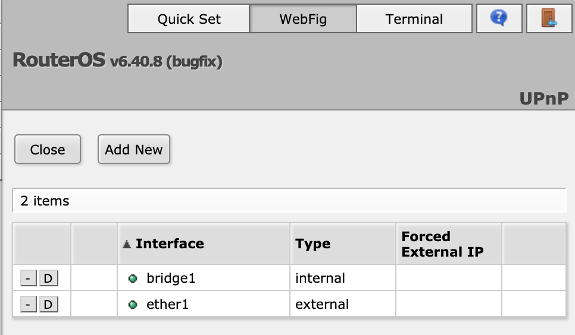

## Running node as docker image on Testnet

Ensure that You have the latest version:
```shell
# docker pull mysteriumnetwork/myst
```

Run node with VPN service on port 1194
```shell
# docker run --cap-add NET_ADMIN --net host --name myst --rm mysteriumnetwork/myst service --agreed-terms-and-conditions
```

**Note1.**
By adding `--agreed-terms-and-conditions` command line option you accept our [Terms & Conditions](/about/terms-and-conditions/)

**Note2.**
It's mandatory to run container with `--net host` to correctly detect VPN service ip which needs to be published to clients, assuming that host has external interface with public ip

**Note3.**
It's mandatory to run container with `--net default --publish "1194:1194/udp"`, assuming that host machines is Windows/OSX. We support `--net host` only if host machine is Linux.

**Note4.**
It's mandatory to run container with `--net default --publish "1194:1194/udp"` and do port forwarding PUBLIC_IP:1194 -> NODE_IP:1194, assuming that host doesn't have external interface with public ip.
E.g. My publicly visible ip is [78.X.Y.Z] and my laptop's local ip [192.168.1.102], so I port forwarded 78.X.Y.Z:1194 -> 192.168.1.102:1194 in router, which I have access to.


## Node system requirements

Current node binaries should run on x86-64 linux architecture. Other architectures might work, but are not being tested.
We test our docker images on Ubuntu 16.04, Debian 9 and CentOS 7.

To be able to run docker image, Your OS should support docker. This usually means that Your OS should have linux kernel version >= 3.10

Since Mysterium Network node is written in `go` its memory footprint is quite small. Most of the resources will be consumed by OpenVPN, Ethereum wallet (integrated into our binary) and system itself.

Minimum resources we tested with was 1GB of RAM.

It is suggested to run a node on a decent network connection to give VPN users best experience.

## What OpenVPN version is required?

If You compiled a node or client on Your own, check that OpenVPN version on Your system is >= 2.4.4

## Router configuration for nodes behind NAT

NAT (Network Address Translation) is used to enable internet access for
computers that do not have an external internet address (IP). Usually of the form like 
192.168.x.y or 10.x.y.z
 
If you are running a node on a computer behind NAT you will need some means to 
enable access to your node from outside your local network. Below are suggested 
methods to enable such external access. 

Essentially you need to make ports on which node services run accessible from outside.
Such enablement is also called "_port forwarding_".

### Enable UPnP or NAT-PNP support

UPnP and NAT-PNP protocols provides automatic port configuration features for various routers (gateways).
Some routers have these features enabled by default, some have not. Below are some examples how to enable such features.

#### Mikrotik (RouterOS) 

Enable UPnP: IP -> UPnP -> Enable


Enable UPnP interfaces: IP -> UPnP -> Interfaces


#### ZTE MF286  

Enable UPnP: Advanced settings


### TP-LINK AC1750

Enable UPnP: Advanced -> UPnP 


