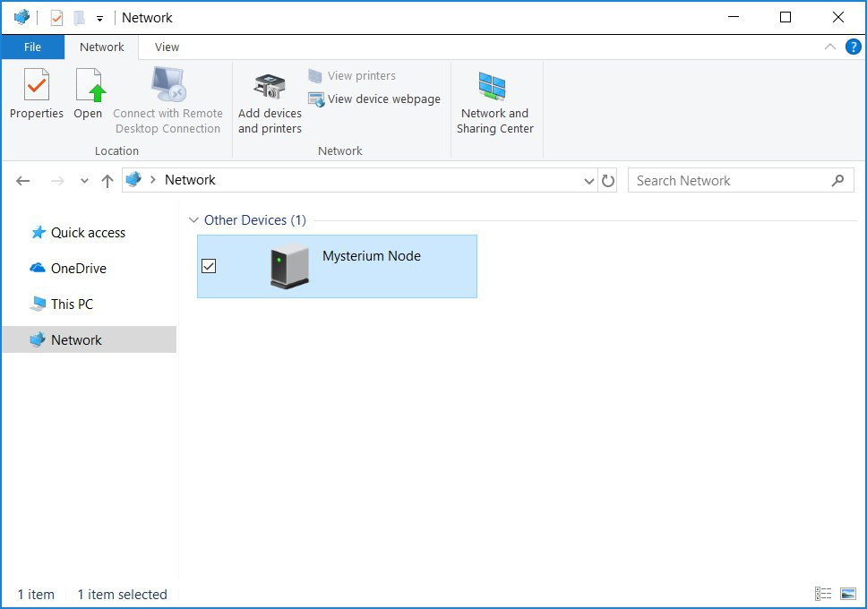

## Node installed with a DEB package
Mysterium node can be installed using a DEB package for most of the Debian-like systems.

[Prebuilt image](/user-guide/installation/#running-mysterium-node-on-a-raspberry-pi) for Raspberry Pi is using a node installed with the same DEB package.

### Startup configuration
The installed DEB package will be starting a node service automatically.

You can check details using the following command:

```
sudo systemctl status mysterium-node.service
```

You can change the configuration of the service via `/etc/default/mysterium-node` file:

```
root@raspberrypi:~# cat /etc/default/mysterium-node
# Define additional args for `myst` service (see `myst --help` for full list)
CONF_DIR="--config-dir=/etc/mysterium-node"
RUN_DIR="--runtime-dir=/var/run/mysterium-node"
DATA_DIR="--data-dir=/var/lib/mysterium-node"
DAEMON_OPTS="--tequilapi.address=0.0.0.0"
SERVICE_OPTS="openvpn"
```

List of available options can be found using a help commands: `myst --help` or `myst service --help`.

For example, if you want to start only OpenVPN service on 1190 port and serve Mysterium verified consumer only, change the `SERVICE_OPTS=` line to the following:

```
SERVICE_OPTS="openvpn --openvpn.port=1190 --access-policy.list mysterium"
```

To apply the changed service configuration you will need to re-read configuration and restart it.

```
sudo systemctl daemon-reload
```

```
sudo systemctl restart mysterium-node
```

### TequilAPI and CLI
Runtime configuration of the running Mysterium node can be changed using a [TequilAPI](https://tequilapi.mysterium.network/) or CLI commands.

**TequilAPI** is a REST API that allows you to manipulate a Mysterium node multiple ways.

```
curl http://localhost:4050/healthcheck

{
    "uptime": "47m55.616006453s",
    "process": 5490,
    "version": "0.0.0-dev",
    "buildInfo": {
        "commit": "99d37edc952b736e3fad069f56e7d968276634a8",
        "branch": "master",
        "buildNumber": "4755"
    }
}
```

**CLI** is a command line interface that allows you manipulate a Mysterium node using just your terminal.
It can be started using a `myst cli` command:

```
myst@raspberrypi:~ $ myst cli
Mysterium Node
  Version: 0.0.0-dev
  Build info: Branch: master. Build id: 4755. Commit: 99d37edc952b736e3fad069f56e7d968276634a8
...
» healthcheck
[INFO] Uptime: 50m25.039797872s
[INFO] Process: 5490
[INFO] Version: 0.0.0-dev
[INFO] Branch: master. Build id: 4755. Commit: 99d37edc952b736e3fad069f56e7d968276634a8
»
```

#### Identities

To get a list of Mysterium node identities you can use the following commands:

```
curl http://localhost:4050/identities

{
    "identities": [
        {
            "id": "0x041e42becaa3a6f92e155a7a5cab62c49dcdc578"
        }
    ]
}
```

```
myst@raspberrypi:~ $ myst cli
...
» identities list
[+] 0x041e42becaa3a6f92e155a7a5cab62c49dcdc578
»
```

To add a payout ETH address to the identity use the following commands:

```
curl -X PUT -d '{"ethAddress":"0x000000000000000000000000000000000000000a"}' http://localhost:4050/identities/0x041e42becaa3a6f92e155a7a5cab62c49dcdc578/payout
```

```
myst@raspberrypi:~ $ myst cli
...
» payout set 0x041e42becaa3a6f92e155a7a5cab62c49dcdc578 0x000000000000000000000000000000000000000a
[SUCCESS] Payout address 0x000000000000000000000000000000000000000a registered.
»
```

### Logs

To get a detailed log for Mysterium node service, you can use the following command:

```
sudo journalctl -u mysterium-node.service
```

## Built-in UI and Node LAN discovery

It is possible to start a Mysterium node with a built-in UI server to do the basic configuration.

The `--ui.enable` flag should be used to start a node with built-in UI.

Default port for built-in UI server is `:4449`, and to get access to it you need to open [http://<mysterium-node-ip>:4449](http://<mysterium-node-ip>:4449).

There are several ways to discover a Mysterium Node IP-address.

### Locally hosted Mysterium Node

If you are running a Mysterium node on the same machine that will be used for accessing UI you just need to use the following address:

[http://localhost:4449/](http://localhost:4449/)

### Using a Windows system for accessing Mysterium Node with UI

SSDP based protocol is used for Mysterium Node discovery on Windows systems. Once you have a Mysterium Node with enabled UI running in your local network, it will be possible to see it automatically in the Network section of the Windows Explorer:



You just need to double click on the device icon to open the UI in the default browser.

### Using a Mac OS system for accessing Mysterium Node with UI

Mac OS uses a Bonjour technology for automatic service discovery.

Mysterium Node with enabled UI will announce Bonjour service to all hosts within the LAN.

To access a Mysterium Node UI you can open in browser link similar to following:

[http://<hostname>.:4449](http://<hostname>.:4449)

`hostname` here is a hostname of the Mysterium Node. For example, if you are running a Raspberry Pi Mysterium Node with a default hostname you can use the following link:

[http://raspberrypi.:4449](http://raspberrypi.:4449)

If you need to run a multiple Mysterium Nodes in the same LAN make sure that you changed a hostname to the unique value.

Also, you can use the following command to list the available Mysterium Nodes in the terminal:

`dns-sd -L "Mysterium Node" _mysterium-node._tcp`

The output should look like this:

```
Lookup Mysterium Node._mysterium-node._tcp.local
DATE: ---Mon 10 Jun 2019---
10:46:31.313  ...STARTING...
10:46:37.849  Mysterium\032Node._mysterium-node._tcp.local. can be reached at MBP-Dmitry.lan.:4449 (interface 8)
```

`MBP-Dmitry.lan.:4449` here is a hostname with a port that can be used for accessing a Mysterium Node UI on the `MBP-Dmitry.lan` host.

### Using a Linux system for accessing Mysterium Node with UI

The similar to Mac OS Linux can automatically use Bonjour discovery to access a Mysterium Node UI.

[http://<hostname>.:4449](http://<hostname>.:4449)

[http://raspberrypi.:4449](http://raspberrypi.:4449) - is a default domain for Raspberry Pi.

If you need some extra tools for listing available Mysterium Nodes you can use an `avahi-utils` for it:

`apt install avahi-utils`

```
root@raspberrypi:~# avahi-browse -r _mysterium-node._tcp
+   eth0 IPv4 Mysterium Node                                _mysterium-node._tcp local
=   eth0 IPv4 Mysterium Node                                _mysterium-node._tcp local
   hostname = [MBP-Dmitry.lan]
   address = [192.168.1.229]
   port = [4449]
   txt = []
```
